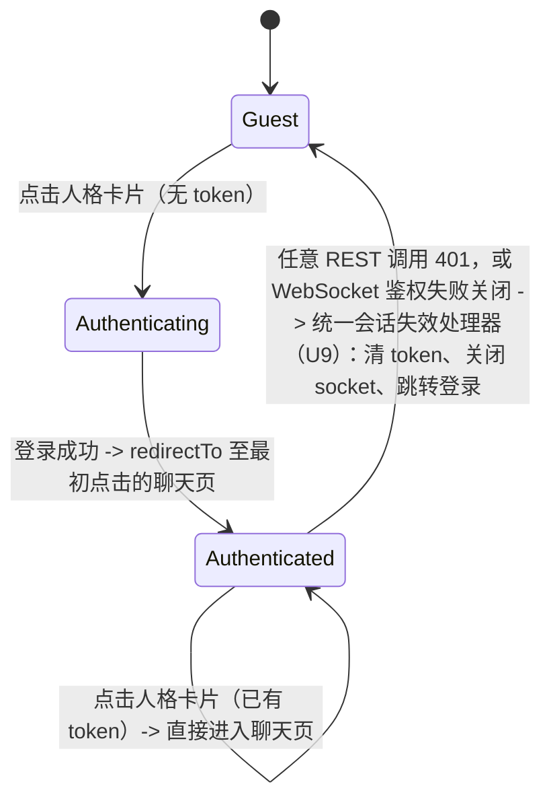
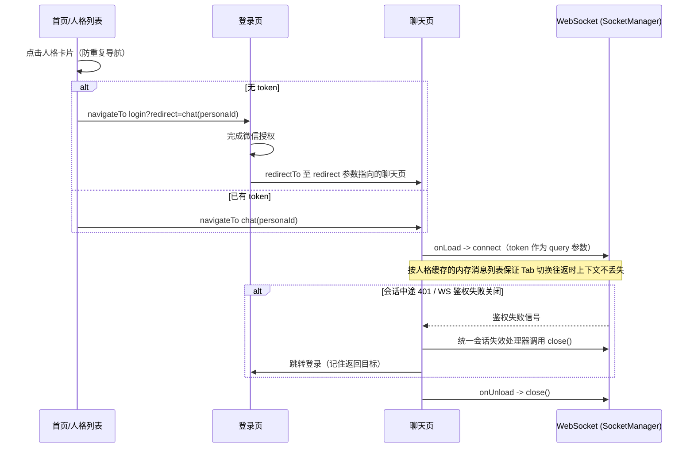

# 网红人格AI对话微信小程序前端实现

## Summary

用原生微信小程序（WXML+WXSS+JS）+ TDesign 组件库（tdesign-miniprogram）实现 4 个核心页面（登录、人格列表、聊天、我的），打通微信登录鉴权、REST 请求层、WebSocket 单例聊天连接与合规展示，一次性覆盖 PRD 定义的三个交付阶段（基础版 → 功能完善 → 合规上线）。后端服务已完成，本计划仅覆盖前端。

---

## Problem Frame

后端 AI Agent 与网红人格模型已就绪，缺一个可用的微信小程序前端来承载登录、人格选择与实时对话体验。PRD（[prd.txt](../../prd.txt)）已给出技术栈、页面结构、接口约定与合规要求，本计划将其转化为可执行的实现单元。

---

## Requirements

- R1. 微信登录全流程：本地 token 有效 → 静默登录；无效/不存在 → 触发微信授权登录 (prd.txt §3)
- R2. token 统一存储与请求头注入；401 清除 token 并跳转登录页 (prd.txt §3.3, §7)
- R3. 支持"暂不登录"浏览模式；进入聊天时强制登录 (prd.txt §3.4)
- R4. 首页展示已上架人格（卡片式），支持搜索与推荐位轮播 (prd.txt §4.2)
- R5. 聊天页通过 WebSocket 与 AI 人格实时文字对话，含"思考中"状态、发送防抖、自动滚动 (prd.txt §4.3, §5, §6.4)
- R6. WebSocket 断线自动重连并展示连接状态 (prd.txt §5, §7)
- R7. 聊天页支持下拉加载历史消息；页面切换后聊天上下文不丢失 (prd.txt §4.3, §5)
- R8. 我的页面：按人格分组的历史会话列表、删除会话、昵称编辑、关于/免责声明入口 (prd.txt §4.4, §3.5)
- R9. AI 回复需经后端内容过滤后才展示 (prd.txt §8.1)
- R10. 人格使用二次元/化名等非真实身份，全局展示"仅为AI趣味模拟"免责声明 (prd.txt §8.2)
- R11. 统一使用 TDesign 组件库保证视觉一致性 (prd.txt §2.5, §7)
- R12. 主包体积控制在微信小程序 2MB 限制内 (prd.txt §7)
- R13. 统一请求层处理 token 注入、401 拦截、错误码与超时 (prd.txt §7)
- R14. WebSocket 连接单例复用，避免重复创建 (prd.txt §7)

---

## Scope Boundaries

- 后端服务、AI 人格模型训练与推理、微信 code→openid/session_key 换取逻辑（PRD 声明已完成，本计划不涉及）
- 仅覆盖微信原生小程序前端，不涉及 App/H5/Web 等其他端
- PRD §10 后续可拓展功能：AI 语音对话、专属场景对话模式、对话分享、付费解锁 — 明确排除在本计划之外
- 账号/数据注销（注销账户）流程：PRD 未定义，涉及国内合规（PIPL 等）考量，建议上线前与法务/合规团队确认是否需要补充（见 Risks & Dependencies）；本计划不作为承诺项目范围处理

---

## Context & Research

### Relevant Code and Patterns

- 当前目录为全新项目（仅含 `prd.txt`），无既有代码、无 `AGENTS.md`/`CLAUDE.md`、无 `docs/solutions/` 历史经验可复用 — 全部实现单元均为新建。

### Institutional Learnings

- 无（`docs/solutions/` 不存在）。

### External References

- `Tencent/tdesign-miniprogram` 官方仓库（GitHub）：npm 集成方式、组件清单、chat 组件族（`chat-list`/`chat-message`/`chat-sender`/`chat-markdown` 等）、版本变更记录
- 微信官方文档：头像昵称填写能力（替代已失效的 `wx.getUserProfile`）、分包与主包体积限制、`wx.connectSocket`/`SocketTask` 多连接支持
- 社区共识模式（多篇独立资料交叉验证）：REST 请求拦截器的 401 单次重定向防抖模式、WebSocket 指数退避重连 + `lockReconnect` 防重复重连模式

---

## Key Technical Decisions

- **WebSocket 生命周期绑定聊天页而非全局常驻**：连接在聊天页 `onLoad` 建立、`onUnload` 关闭，而不是维护一个跨页面常驻的多会话 socket。理由：后端回复payload（prd.txt §6.4）没有消息关联 ID，若维持多人格并发连接，一旦回复到达顺序与请求不一致就可能出现串号（persona A 的回复渲染进 persona B 的界面）；页面级生命周期天然保证同一时刻只有一个连接，从结构上消除这一风险。聊天消息列表按人格在内存中缓存，保证 Tab 切换往返时上下文不丢失，即使 socket 本身会话级重连。**代价与边界（架构复核补充）：** 每次重新进入聊天页都要重新走一次 WS 握手，这是有意接受的延迟代价，而非疏漏。该"同一时刻只有一个连接"的安全性依赖一个未被强制的前提——聊天页不会被重复压栈；微信页面栈中"离开"聊天页并不总是触发 `onUnload`（被新页面压在上面时触发的是 `onHide`）。本计划的导航范围内不存在"从聊天页内再跳转到另一个聊天页实例"的路径（无相关人格跳转等深链），因此该风险当前不适用，但列为明确的不变式：**后续若在聊天页内新增任何跳转到其他页面的入口，需重新评估单连接假设**；同时人格卡片的点击处理器需防止双击时快速触发两次 `navigateTo`（见 U4）。
- **401 强制登出需显式关闭当前聊天 socket**：REST 请求层（U2）的 401 重定向与聊天页的 WebSocket 生命周期此前是两条独立路径。现明确：统一的登出/会话失效处理（U9）在跳转登录页前调用 `SocketManager.close()`，避免鉴权失效后仍有 socket 残留在旧 token 上重连。
- **session_id 由前端生成并按人格持久化复用（待与后端确认）**：PRD 接口清单未说明 session_id 由谁分配；本计划假设前端为每个人格对话生成一个 session_id 并在后续消息/重连中复用。这是一个待验证假设，需在 U6 实现前与后端确认实际约定。
- **聊天历史消息拉取接口为待确认假设**：PRD §6 列出的接口中没有"获取会话内历史消息"的 REST 接口（仅有会话列表/删除），下拉加载历史消息（U7）依赖一个当前未文档化的接口。需在实现 U7 前与后端确认真实契约。
- **WebSocket 鉴权走 URL query 参数而非 header**：原生小程序 WebSocket 对自定义 header 支持不可靠，token 放在 `connectSocket` 的 URL 查询参数中，服务端校验。**安全复核补充：** 这会使长效 token（连同 character_id/session_id）暴露给网关/代理/APM 等基础设施的默认访问日志，风险高于放在 header 中——一旦泄露即可完整冒充该用户直至 token 过期。近期、不涉及后端改造的缓解：要求运维在 WS 端点前的所有日志/APM 层显式脱敏或排除 `token` 查询参数（作为部署检查项，而非默认假设已做到）。中长期建议（需后端配合，超出本计划范围，记为 Open Questions 的后续增强项）：改为一次性、短时效的"连接票据"而非直接传递长效 session token。
- **强制登录拦截点在人格卡片的点击处理器，采用无状态的"登录后跳转意图"而非内存记忆**：拦截发生在导航前（而不是先跳转聊天页再弹回）。目标人格通过登录页路由上的 `redirect` 查询参数传递（如 `login?redirect=/subpackages/chat/pages/chat/chat?personaId=xxx`），登录成功后由登录页读取并 `redirectTo` 该地址，而非依赖 `globalData` 之类的内存单例——后者在登录跳转过程中若小程序进程被系统回收会静默丢失意图。此逻辑封装为 `utils/auth.js` 中一个可复用的鉴权守卫（例如 `requireAuth(targetUrl)`），供人格卡片的点击处理器调用，而非在处理器中各自实现一份，便于未来其他需要登录态才能触发的入口（如"我的"页面的某些操作）复用同一守卫，而不是重复造轮子。
- **聊天页基于 TDesign 官方 chat 组件族构建**（`t-chat`/`t-chat-message`/`t-chat-sender`），而非用 Cell/List 拼装气泡 — 研究确认该组件族已内置且贴合 AI 人格对话场景；由于后端每次回复是一次性完整消息（非流式增量），暂不使用 markdown 流式渲染/thinking 面板等 AI-assistant 专属特性。**选型代价与分包决策的因果关系（架构复核补充）：** 选择 TDesign 而非更轻量的第三方组件库或自行实现，是以其较重的体积（尤其 chat 组件族及其 markdown 子渲染器）为代价换取开发效率与视觉一致性；下方的分包策略正是为抵消这一体积代价而存在，两者是因果关系而非两条独立决策。
- **锁定 tdesign-miniprogram 具体版本号（而非 caret 范围）**：chat 组件族较新，近期已有破坏性变更（如 `ChatSender` 的 `fileAdd` 事件被移除），锁定版本可避免意外升级导致的回归。
- **分包策略**：微信小程序要求 tabBar 页面必须在主包内，因此登录、首页、我的页面在主包；聊天页（引入体积最重的 chat 组件族，见上一条决策）单独分包，并配置 `preloadRule` 在首页停留期间预加载，以保证主包体积控制在 2MB 限制内。
- **审核结果展示不单独区分"内容过滤中"状态**：PRD §8.1 暗示回复是过滤后的单次同步结果，因此复用既有"思考中"指示器覆盖生成+过滤全过程；若回复被过滤拒绝，展示一条友好的系统占位气泡而非静默丢弃。
- **401 处理加单例重定向锁**：避免多个并发请求同时收到 401 导致重复清 token / 重复跳转登录页。
- **REST 与 WebSocket 共用同一个会话失效处理器，而非各自独立判断**：无论是 REST 请求的 401，还是 WebSocket 因鉴权失败被关闭，都归口到 U9 中同一个"会话失效"处理流程（清 token、关闭 socket、跳转登录并记住返回目标），避免两条独立路径各自触发、互相竞态。
- **App 前台恢复时主动续期，而非仅被动等待 401**：token 有效期约 7 天且后端未提供刷新接口，若仅被动依赖 401 才发现失效，在长时间保持前台的单次聊天场景中体验较差。计划在 `onShow`（应用回到前台）时检查本地 token 的存续时间，超过阈值（如已存在 6 天以上）时静默重新走一次 `wx.login()` + `POST /api/user/login` 换取新 token——这不需要后端提供刷新接口，只是把既有登录接口从"仅被动触发"改为"也主动触发一次"。
- **头像昵称获取使用 `chooseAvatar` + `<input type="nickname">`（包在 `<form>` 内配合 submit 按钮）**：替代已失效的 `wx.getUserProfile`（该 API 现仅返回占位灰色头像与"微信用户"昵称）。

---

## Open Questions

### Resolved During Planning

- WebSocket 与页面导航的生命周期关系 → 绑定聊天页 onLoad/onUnload（见 Key Technical Decisions）
- 游客模式强制登录后应回到哪里 → 通过登录页路由的 `redirect` 参数（无状态）直接进入用户最初点击的那个人格聊天页，而非依赖内存记忆
- 内容过滤等待期间的 UI 状态 → 复用现有"思考中"指示器，过滤拒绝展示占位气泡
- 聊天页是否可能被压栈出现多个实例，从而破坏"同一时刻只有一个 socket"的假设 → 本计划范围内聊天页没有向其他页面的深链跳转，风险当前不适用，但列为明确不变式（见 Key Technical Decisions），并在人格卡片点击处加防抖/防重复导航
- REST 401 与 WebSocket 鉴权失败是否会各自触发竞态的登出逻辑 → 归口到 U9 统一的会话失效处理器，两条路径不再各自独立处理

### Deferred to Implementation

- session_id 到底由前端生成还是后端分配 — 需在 U6 前与后端确认实际接口契约
- 聊天历史消息拉取的真实 REST 接口 — PRD 接口清单未包含，需在 U7 前与后端确认
- 删除会话（`DELETE /api/session/del`）是否同时重置服务端对该人格的对话记忆，还是仅清除前端可见历史 — 影响 U8 的删除确认文案，需与后端确认
- tdesign-miniprogram chat 组件族对基础库版本的具体最低要求（研究中发现整体库要求存在 `^2.6.5`/`^2.12.0` 两种口径不一致的资料）— 在 U1 实现时于微信开发者工具中直接核实
- 合规文案最终措辞及是否需要账号/数据注销流程 — PRD 未定义，建议上线前交由法务/合规团队确认（非法律建议）
- WebSocket 鉴权是否可由长效 token 改为后端签发的一次性短时效连接票据 — 需后端配合，非本计划（纯前端）范围，作为向后端团队提出的后续增强建议，而非本计划的交付项
- `GET /api/character/list`（及 `/info`）是否真的无需鉴权支持游客浏览 — PRD 未明确说明，U4 假设为公开接口；若后端实际要求 token，游客浏览（R3）将在 U4 实现时静默失效，需在 U4 前与后端确认（文档审查发现：此前该假设仅在 U4 内部文字中提及，未与其他三项待确认假设同等地被追踪）
- WebSocket 回复 `code` 字段各取值的具体语义（成功/内容过滤拒绝/其他错误分别对应什么值）— PRD §6.4 未定义，U6 的过滤拒绝判断依赖这一约定，需在 U6 前与后端确认（同上，此前未被追踪为待确认项）
- 免责声明横幅的"关闭"是仅对当前页面访问/会话生效，还是会被记忆为"以后都不再展示" — 若选择永久记忆，可能与 R10"全局展示"的合规要求冲突；需要一次产品/合规判断，而非技术默认值（设计复核发现）
- 聊天"思考中"指示器在无响应多久后应转为"发送失败/无响应，点击重试"状态 — 需要一个具体的超时时长（产品判断，而非技术默认值），当前计划仅确定"需要有上限"这一原则（设计复核发现）
- App `onShow` 触发的静默续期，其调用的 `POST /api/user/login` 是否真能仅凭 `code`（不含头像昵称）完成 token 刷新，还是后端要求每次调用都携带头像昵称 — 若后端要求后者，该续期机制将无法在无用户交互时静默完成，需要在实现前与后端确认，必要时重新设计该机制（安全复核发现）
- `onShow` 触发的主动续期只在"从后台切回前台"时检查一次，对"从未离开前台的超长单次聊天"这一场景（该机制本意覆盖的场景）不生效 — 需要决定是否再引入一个独立于 onShow 的触发方式（如聊天页内的周期性检查，或每次发送前检查），并权衡额外检查带来的耗电/性能成本（对抗性复核发现，属于需要产品/工程权衡的判断，而非有唯一正确答案的修正）

---

## Output Structure

    project.config.json
    package.json
    app.js
    app.json                      # tabBar: 首页/我的；chat 子包 preloadRule
    app.wxss
    sitemap.json
    utils/
      request.js                  # REST 请求层 + 拦截器
      socket.js                   # WebSocket 单例管理
      auth.js                     # token 存储、登录态校验、导航守卫
      storage.js                  # wx.setStorageSync/getStorageSync 封装
    services/
      user-api.js                 # /api/user/*
      character-api.js             # /api/character/*
      session-api.js               # /api/session/*
    pages/
      login/
        login.js / .json / .wxml / .wxss
      home/
        home.js / .json / .wxml / .wxss
      me/
        me.js / .json / .wxml / .wxss
    subpackages/
      chat/
        pages/
          chat/
            chat.js / .json / .wxml / .wxss
    components/
      persona-card/
      empty-state/
      disclaimer-banner/

*(每个页面/组件目录含 `.js`/`.json`/`.wxml`/`.wxss` 四件套；此结构为范围声明，实现时可按实际情况微调。)*

---

## High-Level Technical Design

> *此图示为方向性设计参考，用于帮助评审者理解鉴权状态、WebSocket 连接状态与页面导航三者如何交互，而非实现规范；实现者应将其视为背景信息而非需要照抄的代码。*

单独罗列每条 Key Technical Decisions 时，鉴权状态、聊天 socket 状态、页面导航栈三者各自看起来都合理；但它们的交互处（例如"已登录且在聊天页中途收到 401 会发生什么"）才是真正容易遗漏的地方，架构复核时正是通过下面这类图示才发现的。

**鉴权状态转换：**

**首次进入聊天的时序（含强制登录与 socket 生命周期）：**

这两张图把"人格卡片点击处理器需要防止双击触发两次导航"和"聊天页不会被压栈出现第二个实例"作为需要保持的不变式显式标注出来（详见 Key Technical Decisions 与 U5/U9 的实现说明），而不是留给实现者自行发现。

---

## Implementation Units

### U1. 项目脚手架与 TDesign 接入

**Goal:** 搭建可运行的原生小程序项目骨架，完成 TDesign 接入、分包结构与 tabBar 配置，为后续单元提供基础。

**Requirements:** R11, R12

**Dependencies:** None

**Files:**
- Create: `project.config.json`, `package.json`, `app.js`, `app.json`, `app.wxss`, `sitemap.json`
- Create: `pages/login/*`（占位）, `pages/home/*`（占位）, `pages/me/*`（占位）, `subpackages/chat/pages/chat/*`（占位）

**Approach:**
- `npm i tdesign-miniprogram`（锁定具体版本号），微信开发者工具执行"构建 npm"并勾选"将 JS 编译成 ES5"
- 移除/避免 `app.json` 中的 `"style": "v2"`（TDesign 官方要求，否则组件样式异常）
- 配置 tabBar：首页、我的；登录页与聊天页为非 tabBar 页面
- 配置分包：聊天页放入 `subpackages/chat`，并设置 `preloadRule` 在首页停留时预加载
- 各页面仅按需在 `usingComponents` 中注册实际使用的 TDesign 组件，不做整体引入，保护主包体积预算

**Patterns to follow:** TDesign 官方 npm 构建流程（research finding）

**Test scenarios:**
- Test expectation: none -- 纯脚手架/配置单元，无行为需要验证，仅需确认"能在开发者工具中编译运行并进入登录页"

**Verification:** 微信开发者工具编译无 npm/构建报错；应用启动后进入登录页；占位页面上的 TDesign 组件（如 `t-button`）样式渲染正常，确认 `style:v2` 移除生效。

---

### U2. 统一 REST 请求层

**Goal:** 所有 `wx.request` 调用的单一入口，统一处理 token 注入、401 拦截、错误与超时归一化。

**Requirements:** R2, R13

**Dependencies:** U1

**Files:**
- Create: `utils/request.js`, `utils/storage.js`

**Approach:**
- `request(options)` 将 `wx.request` 封装为 Promise；通过存储封装读取 token，注入 `Authorization: Bearer <token>`
- 区分传输层失败（`wx.request` 的 `fail` 回调：超时/无网络）与业务层非成功响应（非 2xx 或业务错误码），分别使用不同的提示文案
- 401 响应：**不直接调用 `wx.reLaunch`**，而是委托给 U9 提供的统一会话失效处理器（清 token → 关闭聊天 socket（若有）→ 通过 `redirect` 参数跳转登录页），并通过模块级"处理中"标志位防止多个并发请求同时触发重复委托（文档一致性修正：早期草稿曾写 `wx.reLaunch`，与 U9/Key Technical Decisions 确立的"记住返回目标"跳转方式冲突，`wx.reLaunch` 会清空页面栈丢失待返回的聊天目标，此处以 U9 的统一处理器为准）
- 登录/校验相关接口需排除在 401 自动重定向逻辑之外，避免登录页自身请求 401 导致循环跳转
- 显式设置比平台默认更短的请求超时，并与"无网络"错误使用不同提示文案
- U2 在 Phase 1 交付时，U9（Phase 2）尚不存在；Phase 1 阶段可暂以"清 token + `wx.navigateTo` 到登录页（不带 redirect）"作为过渡实现，但需在 U9 落地时改为调用统一处理器，而不是长期维持两套并行的 401 处理逻辑

**Patterns to follow:** 社区请求拦截器约定（单次重定向防抖、fail 与非 2xx 区分）

**Test scenarios:**
- Happy path: 有效 token + 200 响应 → resolve 解析后的数据，请求头包含 Authorization
- Edge case: 无 token（游客模式）→ 不需要鉴权的接口仍可正常发出请求，不携带 Authorization
- Error path: 401 响应 → 清除 token 并跳转登录页，即使多个并发请求同时收到 401 也只跳转一次、不重复提示
- Error path: 请求超时 vs. `wx.request` 的 `fail`（无网络）→ 分别展示不同提示文案
- Integration: 登录/校验接口自身不会触发 401 重定向循环

**Verification:** 手动模拟一个失效/无效 token 触发 401（真实或桩接口）时仅跳转登录页一次、无重复提示；正常鉴权请求在开发者工具网络面板中可见携带正确的 Authorization 头。

---

### U3. 微信登录与鉴权流程

**Goal:** 完整登录生命周期 — token 有效静默登录、无效/缺失触发微信登录、游客浏览模式、头像昵称获取。

**Requirements:** R1, R3

**Dependencies:** U1, U2

**Files:**
- Create: `utils/auth.js`, `pages/login/login.js`, `pages/login/login.json`, `pages/login/login.wxml`, `pages/login/login.wxss`
- Create: `services/user-api.js`

**Approach:**
- 启动检查本地 token（经 `auth.js`）；存在则调用 `GET /api/user/check`：有效 → `app.globalData.isLoggedIn = true` 并进首页；无效/过期 → 清除 token 进登录页；不存在 → 直接进登录页
- 登录页：`<button open-type="chooseAvatar">` + `<input type="nickname">` 包在 `<form>` 内，配合 submit 类型按钮（微信当前推荐做法 — 头像/昵称审核为异步，脱离 form/submit 流程可能静默失败）
- 提交后：`wx.login()` 换取 code → `POST /api/user/login`（携带 code + 头像昵称）→ 存储返回的 token
- 拒绝/未完成授权：展示"需要微信授权才能使用"提示 + 重新授权按钮，不强制退出应用
- "暂不登录"入口直接以游客模式（`isLoggedIn = false`）进入首页
- 登录页读取路由 `redirect` 查询参数（登录成功后 `redirectTo` 至该地址），并在 `utils/auth.js` 中提供一个可复用的 `requireAuth(targetUrl)` 守卫函数，供 U4 等任意需要"未登录则先登录再继续"的入口调用，而非各自实现一份判断逻辑（Key Technical Decisions）

**Patterns to follow:** 微信当前头像昵称填写能力（研究确认，替代已失效的 `wx.getUserProfile`）

**Test scenarios:**
- Happy path: 本地存有有效 token → `GET /api/user/check` 成功 → 静默跳转首页，不展示登录 UI
- Happy path: 无 token，用户完成头像昵称填写并提交 → `wx.login()` 换取 code 成功，token 存储，跳转首页
- Happy path: 带 `redirect` 参数进入登录页并完成授权 → `redirectTo` 至 `redirect` 指向的地址，而非默认首页
- Edge case: 本地存有 token 但已失效（check 返回 401）→ 清除 token，展示登录页
- Edge case: 用户点击"暂不登录"→ 以游客模式进入首页，不存储 token
- Error path: 用户未完成头像昵称表单（拒绝授权）→ 展示"需要微信授权"提示 + 重试入口，应用不强制退出
- Error path: `wx.login()` 换取 code 或 `POST /api/user/login` 失败（网络/后端错误）→ 展示错误提示，停留登录页，可重试

**Verification:** 无 token 冷启动落到登录页；完成微信授权表单后跳转首页且本地已存有 token；再次启动应用静默进入首页、不再展示登录 UI。

---

### U4. 首页 / 人格列表页

**Goal:** 可浏览的人格列表，支持搜索与推荐轮播；作为按鉴权状态拦截聊天入口的关键节点。

**Requirements:** R4, R3（强制登录触发点）

**Dependencies:** U1, U2, U3

**Files:**
- Create: `pages/home/home.js`, `pages/home/home.json`, `pages/home/home.wxml`, `pages/home/home.wxss`
- Create: `services/character-api.js`, `components/persona-card/*`, `components/empty-state/*`

**Approach:**
- 页面加载调用 `GET /api/character/list`（假设该接口无需鉴权，支持游客浏览；若后端实际要求鉴权需回来调整）；如需详情可按需调用 `GET /api/character/info`
- 布局使用 TDesign `t-grid` + 自定义 `persona-card` 组件（tdesign-miniprogram 无字面意义的"Card"组件，研究确认）；`t-search` 做搜索；`t-swiper` 做推荐位轮播
- 人格卡片的点击处理器调用 U3 提供的共享 `requireAuth(targetUrl)` 守卫（而非自行判断鉴权状态）：已登录 → 直接进入 `subpackages/chat/pages/chat`；游客 → 跳转登录页并携带 `redirect` 参数指向该人格聊天页，登录成功后由登录页 `redirectTo` 过去 — 即强制登录的拦截点（Key Technical Decisions）
- 点击处理器需做重复触发防护（例如处理中即忽略后续点击），避免用户快速连点在导航完成前触发两次 `navigateTo`，从而压栈出现多个聊天页实例（架构复核发现的不变式，见 Key Technical Decisions）
- 游客登录跳转期间小程序进程可能被系统挂起数秒至数分钟（这正是采用 `redirect` 参数而非内存记忆的原因，见 Key Technical Decisions）；这段时间内目标人格理论上可能被下架/删除 — 该场景的校验逻辑归属聊天页 `onLoad`（见 U6），非本单元职责
- 搜索结果为空时展示 `empty-state` 组件

**Patterns to follow:** `components/empty-state/*` 会被 U8 的会话列表空状态复用

**Test scenarios:**
- Happy path: 人格列表加载并以卡片形式渲染；推荐轮播根据列表响应中的标记渲染
- Happy path: 已登录用户点击人格卡片 → 直接进入该人格的聊天页
- Edge case: 搜索无匹配结果 → 展示 empty-state 组件，而非空白页
- Edge case: 游客（无 token）点击人格卡片 → 跳转登录页（而非静默跳转聊天页）；完成登录后直接进入最初点击的那个人格聊天页，而非退回首页
- Edge case: 在导航尚未完成时快速连点同一张或不同人格卡片 → 只触发一次 `navigateTo`，不会压栈出现多个聊天页实例
- Error path: `/api/character/list` 请求失败 → 提示 + 重试入口，而非空白页

**Verification:** 游客与已登录两种状态均可从冷启动到达首页；游客模式下点击卡片、完成登录后落在正确的人格聊天页，而非退回首页。

---

### U5. WebSocket 单例聊天连接管理

**Goal:** 管理聊天 WebSocket 连接/重连/销毁生命周期的单一可复用模块，生命周期绑定聊天页。

**Requirements:** R6, R14

**Dependencies:** U1, U3（token）

**Files:**
- Create: `utils/socket.js`

**Approach:**
- 模块级单例（不绑定任何 Page 实例）；暴露 `connect(characterId, sessionId)`、`send(message)`、`close()`，以及状态获取/订阅（`connecting|open|reconnecting|closed`），供聊天页展示连接状态
- `connectSocket` 的 URL 携带 token 作为 query 参数（Key Technical Decisions）而非 header，因原生 WebSocket 对自定义 header 支持不可靠
- 重连：指数退避（封顶，例如最长约 30s）并限制最大重试次数，配合 `lockReconnect` 防止 `onError`/`onClose` 同时触发导致的重复重连
- 在 `SocketTask` 实例上绑定事件处理（`.onOpen/.onMessage/.onClose/.onError`），而非已弃用的全局风格 API，避免跨实例的处理器串扰
- 生命周期绑定聊天页（Key Technical Decisions）：`connect()` 在聊天页 `onLoad` 调用，`close()` 在 `onUnload` 调用 — 任意时刻只有一个连接实例存活，结构性避免跨人格回复串号；该不变式依赖聊天页不会被压栈出现第二个实例（见 U4 的防重复导航、Key Technical Decisions 中的不变式说明）
- `close()` 同时可被 U9 的统一会话失效处理器在鉴权失效时主动调用（而不仅是页面 `onUnload` 触发），确保 401/WS 鉴权失败后不会有 socket 残留在旧 token 上尝试重连
- **重连时重新从存储读取当前 token，而非复用 `connect()` 首次调用时闭包捕获的 token 值**：若 App 前台恢复的主动续期（见 Key Technical Decisions）在一次重连退避等待期间刷新了 token，下一次重连尝试必须使用刷新后的新 token，否则会反复用已失效的旧 token 握手失败，被误判为"连接彻底断开"而非"token 需要更新"（架构与安全复核共同指出的缺口）
- **心跳/ping 为必需项，而非可选项**：微信客户端在小程序被系统挂起后台期间可能不触发 `onClose`/`onError` 就静默丢弃底层连接，若无心跳主动探活，恢复前台后 `state` 会停留在过期的 `open`，用户直到下次发送消息才会发现连接早已失效（研究与架构/可行性复核共同指出的缺口，均建议将其从"可选"改为必需，对应 R6 的可靠重连要求）。轻量心跳/ping 按固定间隔发送，未在预期时间内收到响应即视为连接假死，触发与 `onClose` 相同的重连流程；同时在 App `onShow`（回到前台）时，若聊天页处于活跃状态，主动做一次连接健康检查，而不仅依赖心跳的下一个周期

**Technical design:** *(此处为方向性设计示意，非实现规范，实现者应将其视为背景信息而非需要照抄的代码)*

    SocketManager
      state: 'idle'|'connecting'|'open'|'reconnecting'|'closed'
      connect(characterId, sessionId) -> 从存储读取当前 token（而非接受调用方传入的闭包值）-> 打开 SocketTask，绑定实例级 handler
      heartbeat（必需）-> 固定间隔 ping，超时未响应视为假死 -> 触发与 onClose 相同的重连流程
      onClose/onError -> 若非用户主动关闭: state='reconnecting'，退避计时器 -> 再次 connect()（重新读取当前 token，有上限）
      onShow（App 回到前台，聊天页活跃时）-> 主动做一次连接健康检查，不仅依赖心跳的下一周期
      send(payload) -> 仅当 state === 'open' 时发送，否则拒绝/提示"未连接"
      close() -> 用户或页面发起的销毁，清除任何待触发的重连计时器与心跳计时器

**Patterns to follow:** `SocketTask` 实例级 handler 绑定模式、指数退避 + 加锁重连模式（研究结论）

**Test scenarios:**
- Happy path: `connect()` 打开连接并将状态置为 `open`；`open` 状态下 `send()` 能正常发出消息
- Edge case: 服务端意外关闭连接 → 状态转为 `reconnecting`，发生退避重试，重连成功后恢复 `open` 且沿用同一 characterId/sessionId
- Edge case: 重连次数超过上限 → 状态转为终态 `closed` 并展示手动重试入口，而非无限重试
- Edge case: 同一次断连同时触发 `onError` 与 `onClose` → 只启动一次重连序列，而非两次
- Edge case: 心跳在预期时间内未收到响应（连接假死但未触发 `onClose`）→ 判定为假死并触发与 `onClose` 相同的重连流程，而非停留在过期的 `open` 状态
- Edge case: 一次重连退避等待期间，App 前台恢复的主动续期刷新了本地 token → 下一次重连尝试使用刷新后的新 token，而非复用首次 `connect()` 时的旧 token
- Integration: 聊天页 `onUnload` 调用 `close()` 时若存在待触发的重连计时器或心跳计时器 → 计时器均被清除（销毁后不再发起重连或心跳）

**Verification:** 在开发者工具中模拟断网/恢复网络，聊天进行中会展示"重连中"指示并在恢复后回到 `open` 状态；离开聊天页后连接被彻底清理、无残留的重连计时器（可在开发者工具中观察）。

---

### U6. 聊天页核心（收发消息）

**Goal:** 核心聊天体验 — 消息列表、输入框、经 socket 管理器收发消息、思考中指示器、防抖、连接状态展示。

**Requirements:** R5

**Dependencies:** U2, U3, U4, U5

**Files:**
- Create: `subpackages/chat/pages/chat/chat.js`, `subpackages/chat/pages/chat/chat.json`, `subpackages/chat/pages/chat/chat.wxml`, `subpackages/chat/pages/chat/chat.wxss`

**Approach:**
- UI 基于 TDesign 官方 chat 组件族构建：`t-chat`（ChatList 容器）+ `t-chat-message`（气泡，`role`/`placement` 映射人格/当前用户）+ `t-chat-sender`（输入框）— 研究确认该组件族已内置，无需从 Cell/List 拼装
- session id：前端为每个人格对话生成并持久化一个 session id，供后续消息/重连复用（Key Technical Decisions — 待确认假设，实现前需与后端确认真实契约）
- 页面 `onLoad`：先校验 `characterId` 有效（如复用首页已加载的列表数据，或调用 `GET /api/character/info`）——通过 U4 的 `redirect` 续接流程进入本页时，登录跳转期间目标人格理论上可能已被下架/删除；无效则不建立 WebSocket 连接，展示"该人格已下架"提示并引导返回首页（架构复核发现的缺口）。校验通过后，使用当前鉴权 token 调用 `SocketManager.connect(characterId, sessionId)`
- 发送：防抖避免快速连点重复发送；消息乐观地追加到按人格缓存的内存消息列表，展示"思考中"指示器直至服务端回复到达。**待决策（设计复核发现，见 Open Questions）：** 指示器需要一个具体的无响应超时时长，超时后转为该条消息的"发送失败/无响应，点击重试"状态，而非无限等待；具体时长为产品判断，待定后补充测试场景
- **待确认假设：** PRD §6.4 仅说明 WebSocket 接收参数含 `code`、`reply`、`context`，未定义 `code` 各取值的具体语义（成功/过滤拒绝/其他错误分别对应什么值）。本单元的"回复的 `code` 指示内容被过滤拒绝"判断依赖这一未文档化的约定，需在实现前与后端确认 `code` 的取值表，而非假设一个约定直接编码
- 接收：服务端回复追加到消息列表；若回复的 `code` 指示内容被过滤拒绝，展示一条友好的系统占位气泡（Key Technical Decisions）而非静默丢弃
- 连接状态指示器反映 `SocketManager` 的状态（连接中/重连中/已断开），让用户理解发送为何延迟或受阻
- 按人格（character_id）缓存的内存消息存储，使 Tab 切换往返时（同一应用会话内）聊天上下文不丢失，无需 socket 本身保持常连

**Patterns to follow:** TDesign chat-list/chat-message/chat-sender 用法（研究结论）；U5 的 SocketManager

**Test scenarios:**
- Happy path: 用户发送消息，展示思考中指示器，随后展示人格回复气泡
- Happy path: 不关闭应用的情况下从首页/我的页面切回本聊天页，可见消息历史与滚动位置得以保留
- Edge case: 在防抖窗口内快速连点发送 → 最终只发出一条消息
- Edge case: 回复 payload 指示内容被过滤拒绝 → 展示系统占位气泡，而非无声的空缺
- Edge case: 用户在 socket 处于 `reconnecting`/`closed` 状态下尝试发送 → 输入框反映受阻/等待状态，而非静默失败
- Edge case: 经游客登录续接进入聊天页，但目标 `characterId` 已失效/下架 → 不建立 WebSocket 连接，展示"该人格已下架"提示并引导返回首页，而非静默连接失败或崩溃
- Edge case: WebSocket 回复 payload 中 `code`/`reply` 字段缺失或格式异常 → 界面降级为可见的错误提示，而非渲染崩溃或静默丢弃该条回复
- Error path: 对话过程中 token 失效（后端关闭已鉴权的连接）→ 展示重新鉴权提示/跳转，而非无法解释的"死"输入框（与 U9 的鉴权加固衔接）

**Verification:** 针对真实或桩后端，完整的发送→思考中→接收回合能端到端跑通；经首页/我的页面离开再返回聊天页时，可见历史保留、不会因重连闪断而破坏已展示的对话内容。

---

### U7. 聊天历史分页加载与跨页面上下文

**Goal:** 在 U6 的内存上下文基础上，实现下拉加载会话内更早历史消息。

**Requirements:** R7

**Dependencies:** U6

**Files:**
- Create: `services/session-api.js`（历史消息接口调用 — 见下方待确认假设）
- Modify: `subpackages/chat/pages/chat/chat.js`, `subpackages/chat/pages/chat/chat.wxml`

**Approach:**
- 消息列表顶部下拉触发更早消息拉取，前插入内存列表，同时保持滚动位置
- **待确认假设（Key Technical Decisions）：** PRD §6 文档化的接口清单中没有"获取会话内历史消息"的 REST 接口（仅有会话列表/删除对）。本单元假设此类接口存在或将被暴露（例如某个分页的 `GET /api/session/...`）；实现前需与后端团队确认真实契约
- 进入一个已存在（非空）会话时，自动加载最近一页消息，这与下拉触发的"更早历史"拉取是两回事

**Patterns to follow:** 标准下拉刷新 + 前插入模式；复用 U2 的请求层

**Test scenarios:**
- Happy path: 在已有对话顶部下拉可加载并前插入更早消息，且不打乱当前可见滚动位置
- Edge case: 进入全新人格对话（无历史消息）→ 不触发历史拉取，输入框立即可用
- Edge case: 已到达历史起点（最早消息已加载）→ 下拉刷新为空操作并有"没有更多历史"的轻提示，而非重复的失败请求
- Error path: 历史拉取失败（网络/后端错误）→ 提示，列表仍可用，下次下拉可重试

**Verification:** 在与后端确认真实接口契约之前，将"确认接口存在"视为本单元完成的前置条件，而非把假设直接固化进已交付代码中再验证。

---

### U8. 我的页面：会话历史、删除与昵称编辑

**Goal:** 个人信息/设置页面 — 按人格的历史会话、删除、本地昵称编辑、关于/免责声明入口。

**Requirements:** R8

**Dependencies:** U2, U3, U7（`services/session-api.js` 由 U7 创建，本单元在其基础上修改）

**Files:**
- Create: `pages/me/me.js`, `pages/me/me.json`, `pages/me/me.wxml`, `pages/me/me.wxss`
- Modify: `services/session-api.js`（U7 创建）, `services/user-api.js`

**Approach:**
- "我的"是 tabBar 页面，游客（暂不登录模式）随时可能点进本页；页面 `onLoad` 需先判断鉴权状态，游客态下不发起 `GET /api/session/list`（该接口需要 token），而是展示"登录后查看历史"提示 + 登录入口（复用 U3/U4 已建立的 `requireAuth` 模式），避免游客仅因点开此 tab 就被 U2 的 401 拦截器静默强制跳转登录（设计复核发现的缺口：本页此前是唯一没有明确游客态处理的鉴权敏感页面）
- 已登录用户：页面加载调用 `GET /api/session/list`；使用 `t-cell-group`/`t-cell` 渲染（tdesign-miniprogram 无字面意义的"List"组件，研究确认）
- 删除经 `t-action-sheet` 二次确认 → `DELETE /api/session/del`；**待确认假设：** 该操作是否同时重置服务端对该人格的对话记忆，还是仅清除前端可见历史，PRD 未说明 — 需与后端确认，影响向用户展示的确认文案
- 本地昵称编辑通过 `PUT /api/user/update` 持久化到后端；不影响微信侧身份信息（按 PRD §3.5，为既定行为 — 微信信息仅首次获取，不重复同步）
- 无历史会话时展示空状态（复用 U4 的 `empty-state` 组件）
- 关于/免责声明入口链接至 U10 的合规内容

**Patterns to follow:** U4 的 `components/empty-state/*`

**Test scenarios:**
- Edge case: 游客（无 token）点击"我的"tab → 展示"登录后查看历史"提示，不发起 `GET /api/session/list`、不触发 401 强制跳转
- Happy path: 会话列表按人格渲染并附带最近活跃信息；点击一行进入对应人格聊天页（延续既有 session id）
- Happy path: 本地编辑昵称并保存后，经 `PUT /api/user/update` 更新展示的昵称
- Edge case: 全新用户尚无会话历史 → 展示空状态，而非空白列表
- Edge case: 删除一个会话后从列表移除，确认文案与后端实际行为一致（仅清前端历史 vs. 同时重置记忆，待确认后落实）
- Error path: 会话列表或删除请求失败 → 提示，列表状态保持一致（删除失败时不出现误删的假阳性）

**Verification:** 删除会话后列表立即体现；昵称编辑在重新启动应用后仍然持久（从后端获取，而非仅本地缓存）。

---

### U9. 鉴权韧性与边界场景加固

**Goal:** 补齐流程分析发现的缺口 — 对话中途 token 失效、强制登录后的续接体验；统一 App 内加载/空态/错误态的呈现。

**Requirements:** R1, R2, R3, R6, R11（加载/空态/错误态呈现统一，对应视觉一致性要求）

**Dependencies:** U2, U3, U5, U6

**Files:**
- Modify: `utils/auth.js`, `utils/socket.js`, `subpackages/chat/pages/chat/chat.js`

**Approach:**
- 建立统一的会话失效处理器（`utils/auth.js` 内）作为 REST 401（U2）与 WebSocket 鉴权失败关闭（U5）共同的归口路径：清 token → **清空按人格缓存的内存聊天消息（U6）与持久化的 session_id（U6 的待确认假设项）** → 调用 `SocketManager.close()`（若有活跃连接）→ 跳转登录页并携带 `redirect` 参数记住返回目标（复用 U3 的 `requireAuth`/redirect 模式），而不是让两条路径各自独立判断、可能产生竞态（架构与安全复核共同指出的缺口，见 Key Technical Decisions）。清空聊天消息缓存与 session_id 这两步是 System-Wide Impact 中"同一设备上一位用户的对话内容不得残留进入下一位用户或游客会话"这一不变式的实际落地点（此前该不变式仅在 System-Wide Impact 中被描述，未在任何单元的 Approach 中被真正执行 — 安全复核发现的缺口）
- 对话进行中 token 失效：聊天页展示重新鉴权提示；静默重新登录成功则沿用同一 session id 继续对话，否则经统一会话失效处理器跳转登录并在成功后续接回同一聊天页
- App `onShow`（回到前台）时主动检查本地 token 存续时间，超过阈值则静默重新走一次登录换取新 token，减少纯被动等待 401 的中断体验（Key Technical Decisions）。**待确认假设（安全复核发现，见 Open Questions）：** 该"静默"续期能否成立，取决于 `POST /api/user/login` 是否接受仅 `code`（不含头像昵称）的调用；若后端要求每次都携带头像昵称，此机制无法在无用户交互时完成，需实现前与后端确认。**已知局限（对抗性复核发现）：** 该机制仅在"从后台切回前台"时触发一次，对"用户全程未离开前台的超长单次聊天"这一场景（该机制本意覆盖的场景之一）不生效，会退化为纯被动 401；是否需要补充第二触发方式见 Open Questions，本单元先按 onShow 触发实现
- 将 U4/U6/U8 中各自零散引入的加载/空态/错误态整合为一套统一的可复用状态呈现，保证全局体验一致
- 端到端验证"游客浏览 → 点击人格 → 强制登录 → 落地到点击的人格聊天页 → 发送消息"这一完整链路，因为此前没有任何单一单元的手动测试场景覆盖过这整条链路

**Patterns to follow:** U3 的 `requireAuth`/redirect 续接模式、U5 的重连状态机与 `close()` 的外部可调用性

**Test scenarios:**
- Edge case: 对话进行中 token 失效（模拟方式：在 socket 打开期间使已存 token 失效）→ 用户看到重新鉴权提示而非无法解释的"死"输入框；重新登录成功后沿用同一对话继续
- Edge case: 聊天页打开状态下某个 REST 请求恰好触发 401 → 统一会话失效处理器只执行一次清 token/关闭 socket/跳转，而不是 REST 侧和 WS 侧各自触发一次重复动作
- Edge case: 账号 A 登出（或 401 被动登出）后，账号 B（或游客）在同一设备登录 → 之前缓存的按人格聊天消息与持久化的 session_id 均已被清空，账号 B 不会看到账号 A 的历史对话内容，也不会复用账号 A 遗留的 session_id 续接到同一服务端会话
- Edge case: 应用长时间保持前台（模拟 token 已接近过期阈值）→ `onShow` 主动静默续期成功，用户无感知，不出现被动 401 打断对话的情况
- Integration: 完整的"游客 → 强制登录 → 续接聊天"链路作为一次连续的手动走查执行，而非各单元分别验证
- Edge case: 首页（搜索）、我的页面（会话列表）、聊天页（历史加载失败）三处的空态/错误态呈现方式保持一致

**Verification:** 对话中途 token 失效的场景能优雅恢复，无需完整重启应用；REST 与 WS 两条路径触发的会话失效只会执行一次清理动作；账号切换后不会看到上一账号的聊天缓存或复用其 session_id；"游客到聊天续接"链路在一次连续走查中端到端可用。

---

### U10. 合规与免责声明内容

**Goal:** 落实 PRD 要求的合规展示 — 娱乐性质声明、非官方声明、隐私/用户协议入口。

**Requirements:** R9, R10

**Dependencies:** U3, U4, U6（`chat.wxml` 由 U6 创建，本单元在其基础上修改）, U8

**Files:**
- Modify: `pages/home/home.wxml`（插入免责声明横幅）, `subpackages/chat/pages/chat/chat.wxml`（U6 创建，进入人格聊天时插入声明）, `pages/me/me.wxml`（关于/免责声明/隐私协议入口）
- Create: `components/disclaimer-banner/*`

**Approach:**
- 免责声明横幅（`components/disclaimer-banner/`）在首页首次进入时展示，并保持为可见/可关闭的常驻元素，而非仅一次性弹窗 — 呼应流程分析发现的"声明应在每次进入人格聊天时可见，而不仅是首次启动"。**待决策（设计复核发现，见 Open Questions）：** "关闭"操作的记忆范围（仅当次访问 vs. 永久记忆不再展示）尚未确定，需产品/合规判断后再实现，避免与 R10 的"全局展示"要求冲突
- 我的页面承载完整的隐私政策/用户协议/免责声明文本入口（PRD §8.3）
- U6 中 Key Technical Decisions 提到的内容过滤等待/拒绝文案在此处最终确定为面向用户的实际措辞
- **本计划不构建、仅标记的事项：** PRD 未定义账号/数据注销（注销账户）流程；建议上线前与法务/合规团队确认是否需要（见 Risks & Dependencies）— 这不是法律意见，需交由具备资质的团队判断

**Patterns to follow:** `components/empty-state/*`、`components/persona-card/*` 保持一致的组件结构

**Test scenarios:**
- Happy path: 免责声明横幅在首页可见，进入任一人格聊天页时同样可见
- Happy path: 我的页面的隐私/免责声明入口可达并展示所需合规文本
- Test expectation: 文案措辞的最终确定属于内容任务，除"入口可渲染、可达"外无需额外行为验证

**Verification:** 全新游客用户在浏览人格前/浏览过程中即可见免责声明，进入聊天时再次可见；我的页面的合规相关入口均可达。

---

### U11. 真机验证与微信审核就绪清单

**Goal:** 收尾 PRD 第三交付阶段 — 设备/兼容性验证与提审就绪，作为轻量的非编码检查单元，而非编码任务。

**Requirements:** 支持全部功能项的最终验证

**Dependencies:** U1–U10

**Files:** 无（流程/检查单元，无源码文件）

**Approach:**
- 至少在一台 iOS 与一台 Android 微信客户端上完整走查：登录（同意/拒绝/暂不登录）、人格搜索/轮播、完整聊天收发/重连、历史分页、会话删除、昵称编辑、免责声明可见性
- 确认主包体积在 2MB 限制内，聊天子包的 `preloadRule` 在真机上（而非仅开发者工具模拟）行为符合预期
- 核实 tdesign-miniprogram 实际所需最低基础库版本，对照目标用户的基础库分布（研究中发现的口径不一致项）
- 按 PRD §8.3 整理微信小程序提审所需材料（隐私政策声明、免责声明文本、权限使用说明）

**Execution note:** 本单元为验证/检查性质，不产出新功能代码

**Test scenarios:**
- Test expectation: 无自动化行为验证 -- 本单元的"测试"即上述真机走查场景本身，作为交付物手动执行

**Verification:** 上述真机走查场景在至少一台 iOS 与一台 Android 设备上全部通过；主包体积确认低于 2MB；提审材料整理完毕，PRD §8.3 各项逐一核对。

---

## Alternative Approaches Considered

- **全局常驻的多会话 WebSocket 单例**（跨页面/跨人格同时保持多个连接，按 session 建立映射表）：为 MVP 阶段放弃 — 需要后端提供消息关联 ID 才能可靠解决串号问题，而 PRD §6.4 当前的回复 payload 不含此字段；页面级生命周期方案能以更低复杂度结构性规避该问题。若后续后端补充关联 ID 且明确需要"多人格同时对话"，可重新评估。
- **用 TDesign 的 Cell/List 拼装聊天气泡**：放弃 — 研究确认当前使用的库版本已内置专用 chat 组件族，直接复用比自行拼装更贴合且维护成本更低。

---

## Phased Delivery

### Phase 1 — 基础版本（对应 PRD §9.1）
U1 项目脚手架、U2 请求层、U3 登录鉴权、U4 首页人格列表、U5 WebSocket 单例、U6 聊天页核心收发

### Phase 2 — 功能完善（对应 PRD §9.2）
U7 聊天历史分页、U8 我的页面（会话历史/删除/昵称）、U9 鉴权韧性与边界场景加固

### Phase 3 — 合规优化与上线（对应 PRD §9.3）
U10 合规与免责声明内容、U11 真机验证与提审就绪清单

---

## System-Wide Impact

- **Interaction graph:** U2（请求层）被 U3/U4/U8 等所有发起 REST 调用的单元依赖；U5（WebSocket 管理）被 U6/U7 依赖；U3/U9 维护的鉴权状态同时被 U4 的点击守卫与 U6 的页面进入守卫读取
- **Error propagation:** REST 401 → U2 的重定向防抖锁 → 登录页；WebSocket 鉴权失败/关闭 → U6 聊天页 → U9 的重新鉴权流程 → 重连或跳转登录
- **State lifecycle risks:** 按人格缓存的内存聊天消息存储，在登出/清除 token 时必须一并清空，避免同一设备上一位用户的对话内容残留进入下一位用户或游客会话
- **Integration coverage:** "游客浏览 → 点击人格 → 强制登录 → 落地到点击的人格聊天页 → 发送消息 → 收到经过滤的回复"这一完整链路横跨 U3/U4/U6/U9，任何单一单元的独立手动测试场景都无法证明其整体可用性，已在 U9 中作为专门的集成走查场景列出
- **Unchanged invariants:** 后端 API 契约（PRD §6）视为既定不变；本计划不对其做任何修改

---

## Risks & Dependencies

| Risk | Mitigation |
|------|------------|
| WebSocket 鉴权 token（连同 character_id/session_id）放在 URL 查询参数中，可能被网关/代理/APM 等基础设施默认日志记录，泄露后可完整冒充用户直至 token 过期 | 近期：作为部署检查项要求运维在 WS 端点前所有日志/APM 层显式脱敏或排除 `token` 查询参数；中长期：向后端提出改为一次性短时效连接票据的建议（见 Open Questions，非本计划范围） |
| 长效 token 明文存储于 `wx.setStorageSync`（无内置刷新机制） | 对本产品威胁模型（娱乐性对话，非支付/高敏感 PII）可接受；限定 token 作用域仅覆盖本小程序自身接口，不与其他服务共用；登出/401 时确保调用 `wx.removeStorageSync` 彻底清除，不仅是清内存状态 |
| 纯被动 401 处理：无主动续期机制，长时间前台单次聊天场景可能中途失效打断体验 | U9 在 App `onShow` 时主动检查 token 存续时间并静默续期；REST 401 与 WS 鉴权失败归口到同一会话失效处理器，避免竞态（见 Key Technical Decisions） |
| WS 握手 URL 中的会话标识符可能被基础设施日志留存在主数据库的数据治理/删除流程覆盖范围之外，与用户数据删除请求（PIPL 场景）存在潜在不一致 | 与上述日志脱敏为同一处修复点，不单独处理；上线前一并交由法务/合规确认 |
| 聊天历史消息拉取的 REST 接口未在 PRD 中文档化 | 实现 U7 前与后端团队确认真实接口契约；本计划假设该接口存在 |
| tdesign-miniprogram 的 chat 组件族较新，已出现过破坏性变更（如 `ChatSender` 的 `fileAdd` 事件被移除） | 锁定具体版本号而非 caret 范围，未来升级前先核对 CHANGELOG |
| session_id 分配方（前端 vs. 后端）未明确 | 实现 U6 前与后端确认；当前计划假设为前端生成并持久化 |
| `GET /api/character/list`/`info` 是否需要鉴权未在 PRD 中明确 | 实现 U4 前与后端确认；若需要鉴权，游客浏览（R3）将失效并需回来调整 |
| WebSocket 回复 `code` 字段的取值语义未在 PRD 中明确 | 实现 U6 前与后端确认过滤拒绝等各状态对应的具体值，而非假设一个约定直接编码 |
| App onShow 触发的主动续期在从未离开前台的超长单次聊天场景下不生效，退化为纯被动 401 | 需在 U9 实现前决定是否补充一个不依赖 onShow 的第二触发方式（如周期性检查），并权衡耗电/性能成本 |
| 未定义账号/数据注销流程，存在国内合规（PIPL 等）考量 | 上线前提请法务/合规团队评审是否需要补充；非法律意见 |
| 若人格形象/文案逐渐趋近真实可辨识的具体人物，存在肖像/姓名权风险 | PRD §8.2 已要求后端侧内容审核；前端应确保免责声明在每次进入人格聊天时可见，而不仅首次启动时展示一次 |
| 微信小程序审核对"强制授权"类交互较为敏感，是常见驳回原因之一 | PRD 已包含的"暂不登录"路径需确保功能真实可用，而非仅界面摆设 |

---

## Documentation / Operational Notes

- U1 落地脚手架时同步在项目 README 中记录 npm 构建步骤与分包设计理由，避免后续贡献者误删聊天子包拆分
- PRD 未提及监控/埋点体系；若后端后续暴露错误上报或数据分析钩子，U2 的请求层错误处理路径是天然的前端埋点接入点

---

## Sources & References

- **Origin document:** [prd.txt](../../prd.txt)
- External docs: `Tencent/tdesign-miniprogram`（GitHub 官方仓库，chat 组件族与版本变更记录）；微信官方文档（头像昵称填写能力、分包与主包体积限制、`wx.connectSocket`/`SocketTask`）
